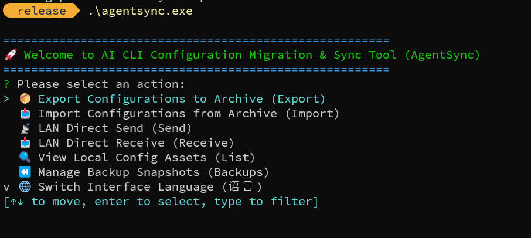
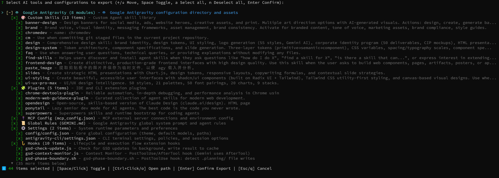

# AgentSync (AI CLI Configuration Transfer & Sync Tool)

**English** | [简体中文](README.md)

Global configuration migration, backup, and LAN synchronization tool (built with Rust) designed for AI coding CLI tools, including Google Antigravity, Anthropic Claude Code, OpenAI Codex CLI, OpenCode, and more.

Seamlessly migrate custom skills (`Skills`), extension plugins (`Plugins`), MCP server definitions, global system rules (`GEMINI.md` / `CLAUDE.md` / `AGENTS.md`, etc.), preferences (`Settings` / `Config`), extension hooks (`Hooks`), as well as optional authentication credentials and runtime states across different machines and environments.

---

## Key Features

- **Native Multi-Tool Support**:
  - Unified aggregation with AI tools as Level 0 root nodes.
  - Built-in support for Google Antigravity, Anthropic Claude Code, OpenAI Codex CLI, OpenCode, and more.
- **Three-Level Interactive Tree Wizard (TUI)**:
  - Level 1 (Root): AI Tools (select or deselect all assets for a tool with one click).
  - Level 2 (Module): Custom Skills, Plugins, MCP Config, Global Rules, Settings, Hooks, Credentials, State, etc.
  - Level 3 (Item): Skill names, plugin names, specific configuration files.
  - Three-state cascade selection: checked, unchecked, and indeterminate (partially checked).
- **Dual Transfer Channels**:
  - **Offline Archive Mode**: Export a self-contained `.zip` archive package with a multi-tool asset catalog (`manifest.json`).
  - **LAN Direct Transfer Mode**: Built-in multi-threaded HTTP transfer engine supporting 6-character alphanumeric PIN verification or `--nopin` passwordless transfer, with concurrent multi-client connections.
- **Security & Privacy Safeguards**:
  - Protects credentials and local session history by default. Marked as `[Sensitive]` and left unchecked initially, requiring explicit manual user authorization.
- **Full Internationalization (i18n)**:
  - Seamless support for both English and Simplified Chinese.
  - Automatic detection: Adapts to system locale settings on launch.
  - CLI override: Set display language via `--lang <zh|en|auto>` or the `AGENTSYNC_LANG` (or `AITRANS_LANG`) environment variable.
  - Runtime switching: Change interface language on the fly inside the TUI menu.
- **Smart Merging & Snapshot Rollback**:
  - Automatically creates a timestamped backup snapshot (stored in `~/.agentsync/backups/`) prior to importing, allowing one-click rollback.
  - Performs key-level merging on files such as `mcp_config.json`.
  - Offers interactive prompt, forced overwrite (`--force`), or automatic skip (`--skip-existing`) strategies for resolving file collisions.

---

## Quick Start

### 1. Interactive Wizard Mode (TUI)
Launch `agentsync` directly in your terminal to open the main menu:
```bash
agentsync
```



#### Tree Select Keyboard & Mouse Shortcuts
In the interactive tree view with AI tools as roots, navigate using your keyboard and mouse:



| Input / Action | Description |
| :--- | :--- |
| `↑` / `k` | Move cursor up by one line |
| `↓` / `j` | Move cursor down by one line |
| `Space` / **Left Click** | Toggle item selection (cascades to all children and updates parent states) |
| `o` / `O` / **Ctrl + Left Click** | **Open local directory or file** (opens and highlights in File Explorer on Windows, Finder on macOS) |
| **Mouse Hover** | **Displays underline highlight beneath hovered item** |
| **Mouse Wheel Scroll** | Smoothly scrolls cursor up or down |
| `a` / `A` / `→` | Select all non-sensitive items across all tools |
| `n` / `N` / `←` | Deselect all items |
| `PageUp` | Scroll up one page |
| `PageDown` | Scroll down one page |
| `Home` | Jump to the top of the list |
| `End` | Jump to the bottom of the list |
| `Enter` | Confirm selection and proceed to the next step |
| `Esc` / `q` / `Ctrl+C` | Cancel current operation and return |

---

## Complete CLI Reference

### Global Arguments

The following option can be placed before or after any subcommand:

| Argument | Type | Values | Default | Description |
| :--- | :--- | :--- | :--- | :--- |
| `--lang <LANG>` | String | `zh`, `en`, `auto` | `auto` | Set display language. Defaults to `auto` (detects system locale); can also be set via `AGENTSYNC_LANG` (or `AITRANS_LANG`) environment variable |

---

### 1. Scan and List Assets (`agentsync list`)

Scan installed AI tools and configuration assets on the local machine and display an organized inventory.

#### Arguments

| Argument | Short | Type | Default | Description |
| :--- | :--- | :--- | :--- | :--- |
| `--tool <TOOLS>` | `-t` | String | All tools | Specify AI tools to scan (comma-separated, e.g. `antigravity,claude,codex`) |

#### Examples

```bash
# Scan and list configuration assets of all installed AI tools
agentsync list

# Scan assets of a specific tool only
agentsync list -t claude
```

---

### 2. Export Configurations (`agentsync export` / `agentsync exp`)

Bundle and export local configuration assets into a `.zip` archive. Launches the interactive tree view by default for granular selection; pass `--all` to export all standard assets directly.

#### Arguments

| Argument | Short | Type | Default | Description |
| :--- | :--- | :--- | :--- | :--- |
| `--output <PATH>` | `-o` | Path | `./agentsync-export-<timestamp>.zip` | Output path and filename of the exported zip archive |
| `--tool <TOOLS>` | `-t` | String | All tools | Limit export to specific AI tools (comma-separated, e.g. `claude,antigravity`) |
| `--all` | | Flag | `false` | Export all standard configuration modules (skips interactive tree selection) |

#### Examples

```bash
# 1. Interactive export: Launch tree wizard to choose tools and modules
agentsync export

# 2. Interactive export for specific tools with custom output path
agentsync export -t claude,antigravity -o ./ai-tools.zip

# 3. Export all non-sensitive modules non-interactively (ideal for automation scripts)
agentsync export -t claude --all -o ./claude-backup.zip
```

---

### 3. Import Configurations (`agentsync import` / `agentsync imp`)

Extract and restore configurations from a `.zip` archive into their respective local directories. Automatically reads the internal manifest and opens the tree selection wizard; pass `--all` to restore all contents directly.

#### Arguments

| Argument | Short | Type | Default | Description |
| :--- | :--- | :--- | :--- | :--- |
| `<FILE>` | (Positional) | Path | Required | Path to the `.zip` archive file to import |
| `--all` | | Flag | `false` | Import all configuration modules from the archive (skips tree selection) |
| `--force` | `-f` | Flag | `false` | Overwrite conflicting files with files from the archive |
| `--skip-existing`| | Flag | `false` | Keep existing local files and skip conflicting archive files |
| `--no-backup` | | Flag | `false` | Skip creating a backup snapshot before importing |
| `--yes` | `-y` | Flag | `false` | Confirm import automatically without terminal prompts |

#### Examples

```bash
# 1. Interactive import: Launch tree wizard to select items to restore
agentsync import ./my-ai-backup.zip

# 2. Incremental import: Skip existing files and keep local versions
agentsync import ./my-ai-backup.zip --skip-existing

# 3. Unattended full import: Import all items, force overwrite, and skip confirmation
agentsync import ./my-ai-backup.zip --all --force -y
```

---

### 4. LAN Direct Transfer - Sender (`agentsync send` / `agentsync serve`)

Start an HTTP service on the local machine to allow target machines to download configuration archives over the local network. Prompts for asset selection via tree wizard by default and keeps the server alive for multiple clients.

#### Arguments

| Argument | Short | Type | Default | Description |
| :--- | :--- | :--- | :--- | :--- |
| `--port <PORT>` | `-p` | Integer | `38992` | Service listening port (falls back to a random available port if occupied) |
| `--ip <IP>` | | String | Auto | Specific IP address to display (recommends physical LAN / Wi-Fi IP by default) |
| `--tool <TOOLS>` | `-t` | String | All tools | Specify AI tools to include (comma-separated) |
| `--all` | | Flag | `false` | Send all standard configuration modules (skips tree selection) |
| `--nopin` | | Flag | `false` | Disable PIN verification, allowing clients to download without a PIN |
| `--once` | | Flag | `false` | Exit service immediately after the first client completes download |

#### Examples

```bash
# 1. Interactive selection and start transfer (generates a 6-character PIN, listens for clients)
agentsync send

# 2. Send all standard assets without interactive wizard
agentsync send --all

# 3. PIN-free direct transfer (for trusted local networks)
agentsync send --nopin

# 4. Single-transfer mode (shuts down service after first successful download)
agentsync send --once

# 5. Specify custom port and explicit IP
agentsync send --port 38992 --ip 192.168.1.100
```

---

### 5. LAN Direct Transfer - Receiver (`agentsync receive` / `agentsync recv`)

Connect to a sender machine on the local network, download the configuration bundle, and apply it locally. Opens an interactive tree view for selective restoring by default; pass `--all` to import everything directly.

#### Arguments

| Argument | Short | Type | Default | Description |
| :--- | :--- | :--- | :--- | :--- |
| `<ADDR>` | (Positional) | String | Required | Sender address (e.g. `192.168.1.50` or with port `192.168.1.50:38992`) |
| `--pin <PIN>` | `-p` | String | Optional | 6-character PIN code (alphanumeric, case-insensitive) |
| `--nopin` | | Flag | `false` | Connect without PIN (sender must have `--nopin` enabled) |
| `--all` | | Flag | `false` | Receive and import all configuration modules (skips tree selection) |
| `--force` | `-f` | Flag | `false` | Force overwrite on filename conflicts |
| `--no-backup` | | Flag | `false` | Skip creating backup snapshot before importing |
| `--yes` | `-y` | Flag | `false` | Auto-confirm import without interactive prompts |

#### Examples

```bash
# 1. Interactive receive (downloads archive and opens tree list for selection)
agentsync receive 192.168.1.50 --pin A8K2M9

# 2. Receive from a PIN-free sender
agentsync receive 192.168.1.50 --nopin

# 3. Receive and overwrite existing files on conflict
agentsync receive 192.168.1.50 --pin A8K2M9 --force

# 4. Fully automated silent import (suitable for setup scripts)
agentsync receive 192.168.1.50 --pin A8K2M9 --all --force -y
```

---

### 6. Snapshot Backup & Rollback (`agentsync backup`)

Manage automatic backup snapshots generated by import actions to safeguard configuration data.

#### Commands

```bash
# 1. List all historical backup snapshots
agentsync backup list

# 2. Restore configurations from a specific snapshot
agentsync backup restore snapshot-20260921-084444
```

---

## Build & Installation

Ensure the Rust toolchain is installed (Rust 1.70+ recommended):

```bash
# Build debug binary
cargo build

# Build release optimized standalone executable
cargo build --release

# Output binary paths
# Windows: target/release/agentsync.exe
# Linux/macOS: target/release/agentsync
```

---

## License

This project is licensed under the [CC BY-NC-SA 4.0](LICENSE) (Creative Commons Attribution-NonCommercial-ShareAlike 4.0 International) license.

- **NonCommercial**: You may not use this material or its derivatives for commercial purposes.
- **Attribution & ShareAlike**: You must give appropriate credit and distribute your contributions under the same license.
